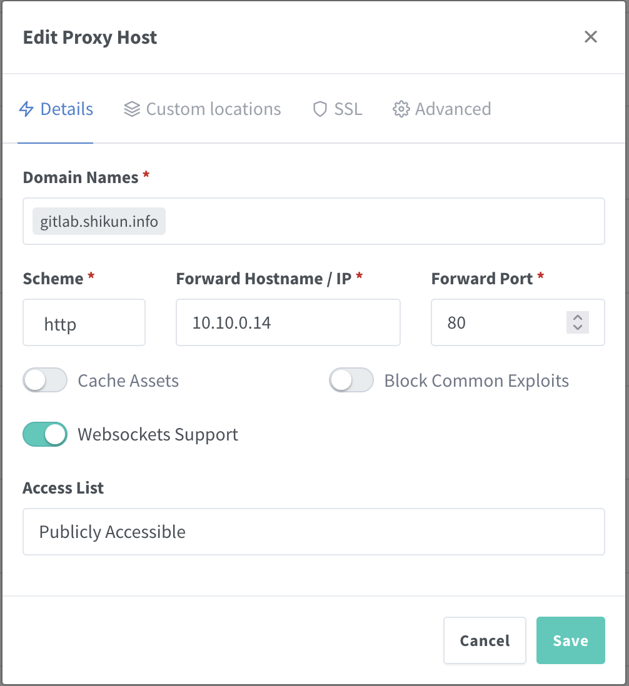
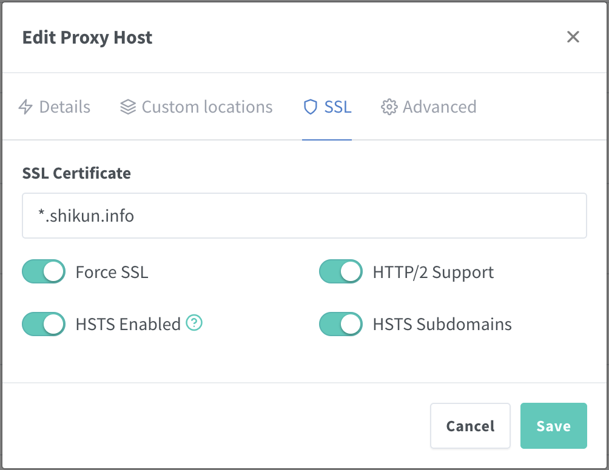
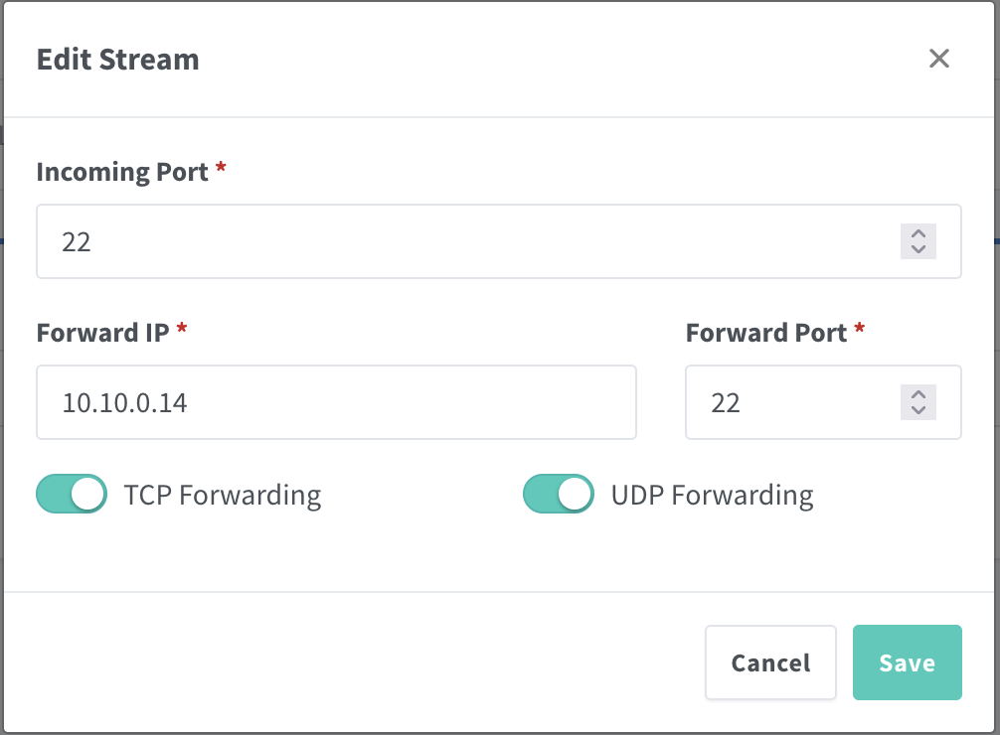

准备一个`docker-compse.yml`文件

```yaml
version: '3'

services:
  gitlab:
    image: gitlab/gitlab-ce
    container_name: gitlab
    restart: always
    environment:
      GITLAB_OMNIBUS_CONFIG: |
        external_url 'https://gitlab.shikun.info' # 指定外部地址，协议为https
        letsencrypt['enable'] = false # 不使用letsencrypt申请ssl证书，因为指定协议为https时，gitlab会自动通过letsencrypt申请ssl证书
        nginx['listen_https'] = false # 因为不申请ssl证书，所以不监听https协议，但是仍然可以在gitlab里显示external_url指定的协议url
        nginx['listen_port'] = 80 # 监听80端口
    ports:
      - '80:80' # 指定暴露80端口，通过反向代理实现https
      - '22:22' # 指定暴露22端口
    volumes:
      - './gitlab/config:/etc/gitlab' # 配置文件目录
      - './gitlab/logs:/var/log/gitlab' # 日志目录
      - './gitlab/data:/var/opt/gitlab' # 生成的数据目录

  gitlab-runner:
    container_name: gitlab-runner
    image: gitlab/gitlab-runner
    restart: always
    volumes:
      - './runner/config:/etc/gitlab-runner'
      - '/var/run/docker.sock:/var/run/docker.sock'
    depends_on:
      - gitlab # 依赖于gitlab服务的启动
```

```bash
sudo docker-compose up -d
```

配置`nginx`服务端，代理 `tcp` 流量 (proxy host)

- ip 127.0.0.1
- 端口 80
- 协议 http
- ssl 证书
- 域名 gitlab.shikun.info

配置`nginx`服务端，代理 `ssh` 流量 (proxy stream)

- ip 127.0.0.1
- 端口 22
- 协议 tcp+udp

比如在`nginxproxymanager`中，add proxy host







访问[`https://gitlab.shikun.info`](https://gitlab.shikun.info)可以看到成功搭建了 gitlab 服务，恭喜 🎉

最终成果


