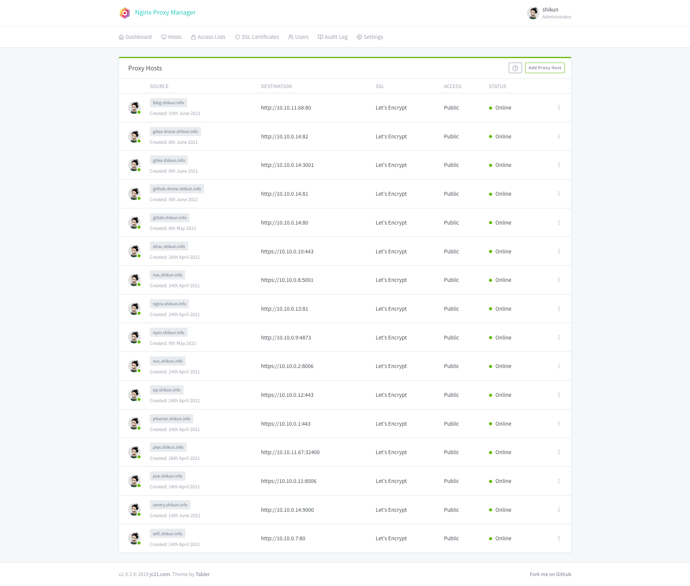

准备一个`docker-compose.yml`文件

```yaml
version: '3'

services:
  nginxproxymanager:
    image: 'jc21/nginx-proxy-manager'
    restart: always
    ports:
      - '22:22'
      - '80:80'
      - '81:81'
      - '443:443'
    environment:
      DB_MYSQL_HOST: 'db'
      DB_MYSQL_PORT: 3306
      DB_MYSQL_USER: 'npm'
      DB_MYSQL_PASSWORD: 'npm'
      DB_MYSQL_NAME: 'npm'
    volumes:
      - ./data:/data
      - ./letsencrypt:/etc/letsencrypt
    depends_on:
      - db
    healthcheck:
      disable: true

  db:
    image: 'jc21/mariadb-aria'
    restart: always
    environment:
      MYSQL_ROOT_PASSWORD: 'npm'
      MYSQL_DATABASE: 'npm'
      MYSQL_USER: 'npm'
      MYSQL_PASSWORD: 'npm'
    volumes:
      - ./data/mysql:/var/lib/mysql
```

修改`ssh`标准端口到其他端口，比如 8022

```bash
sudo vim /etc/ssh/sshd_config
```

```text
...

Port 8022

...
```

重启`sshd`服务

```bash
sudo systemctl restart sshd
```

```bash
sudo docker-compose up -d
```

添加内网`dns`泛域名解析到`nginxproxymanager`服务`ip`

比如 `shikun.info -> 10.10.0.13`

`Pfsense` 中 DNS Resolver `/services_unbound.php`


最终成果


