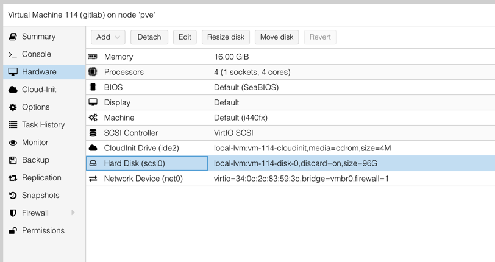
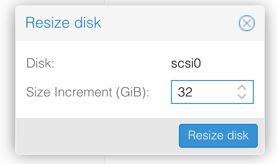
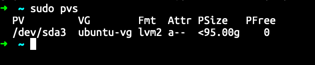
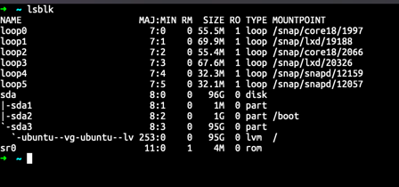
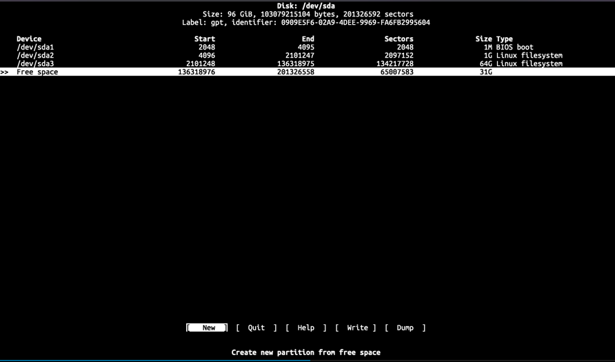
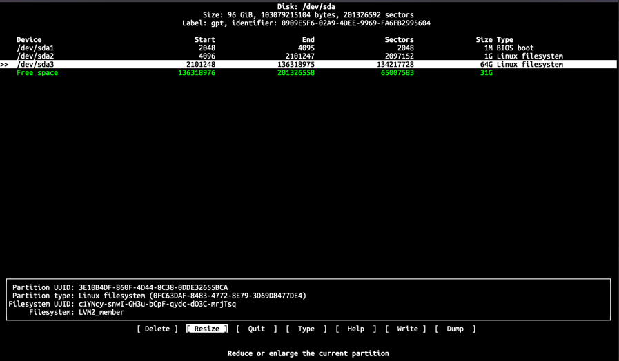
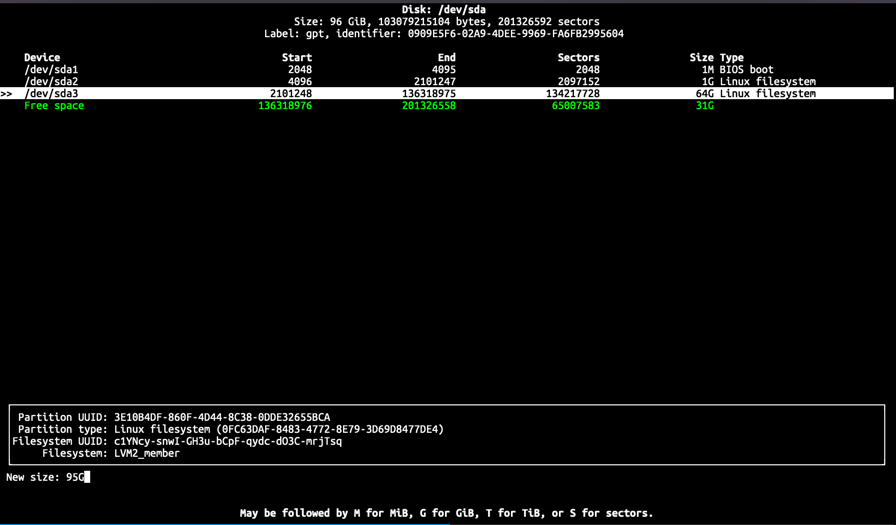

### 1. `PVE` 中的设置

- 图形化方式

  点击 `Hardware -> Resize disk`

  

  

- 命令行方式

  首先查看虚拟机 id

  ```bash
  ssh pve << EOSSH
  qm list
  EOSSH
  ```

  | VMID | NAME   | STATUS  | MEM(MB) | BOOTDISK(GB) | PID |
  | ---- | ------ | ------- | ------- | ------------ | --- |
  | 100  | gitlab | running | 16384   | 96.00        | 0   |

  命令格式

  ```bash
  qm resize <vmid> <disk> <size>
  ```

  例子

  ```bash
  ssh pve << EOSSH
  qm resize 100 scsi0 +32G
  EOSSH
  ```

### 2. `虚拟机` 中的设置

使用`lvm`管理磁盘分区

查看分区并扩展剩余空间至分区

```bash
sudo pvs

lsblk
```





扩展 pvs

```bash
cfdisk /dev/sda
```



将光标移动至 `/dev/sda3`，选择 `Resize`，回车，选择 `Write` 后输入 `yes` 回车，并 `Quit`





将空间写入到 `lvm` 分区

```bash
sudo lvresize -L +100%FREE --resizefs /dev/ubuntu-vg/ubuntu-lv
```
